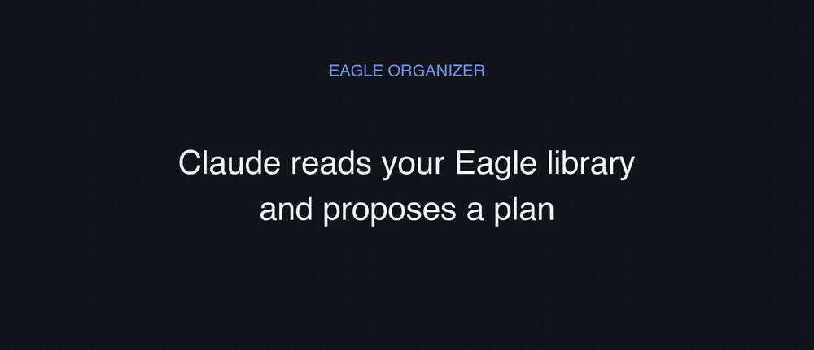

# Eagle Organizer

**English** · [繁體中文](README.zh-TW.md)

A [Claude Code](https://claude.com/claude-code) skill that helps you organize an
[Eagle 4.0](https://eagle.cool) asset library. It visually analyzes your images and videos,
proposes a consistent naming / tagging / folder scheme, and applies the changes through safe,
dry-run-first Python scripts.

Originally built to tame a large UI-reference library, it works for any Eagle 4.0 library once you
fill in your own taxonomy in `config.json`.

> **📐 The point isn't the scripts — it's the system.** The naming, tagging, and folder judgment
> lives in **[`METHODOLOGY.md`](METHODOLOGY.md)**. It's portable: run it here, or hand the preset to
> Eagle's official AI. The tool executes; the system is the taste.

## Demo



*(Before → after on a real Eagle library: a cryptic file name (`image00.png`) becomes descriptive and sorted into folders. Claude proposes the plan; you review, then apply.)*

## When to use this — and when to use Eagle's official AI instead

Since **Eagle 4.0 Build 12 (Sept 2025)**, Eagle ships an official
**[Eagle MCP / Eagle Skill](https://en.eagle.cool/support/article/eagle-mcp-server)** that lets an
AI agent organize your library through a supported, safe API — no file hacking and no need to quit
Eagle. **If you're on a current Eagle build, that is the recommended path for most people**, and
the Eagle Skill already supports Claude Code directly.

This project is worth using when you specifically want:

- **Eagle 4.0 file-level control** on builds without the MCP plugin, or fully offline/local
  scripting with no MCP server running.
- **An opinionated organizing _system_ for product / UI-design reference libraries** — the naming
  templates, tag taxonomy, and "a flow video is filed under its starting screen" heuristics —
  rather than a generic "tidy my library" pass.
- To understand **how Eagle 4.0 stores its data on disk** (see
  [`docs/eagle-4.0-internals.md`](docs/eagle-4.0-internals.md)).

To run this methodology *through* Eagle's official MCP instead of the bundled file-level scripts,
see [`docs/path-a-eagle-mcp-methodology.md`](docs/path-a-eagle-mcp-methodology.md).

## ⚠️ Read this first

These scripts **rewrite Eagle's internal cache and metadata files** — that is how Eagle stores
names, tags, and folder assignments. The power comes with real risk:

- **Eagle must be fully quit (Cmd+Q) before applying.** Eagle rewrites metadata live; if it's open
  while a script writes, your changes are lost or the cache is corrupted. Every apply path checks
  this and refuses to run while Eagle is open.
- **Every script defaults to dry-run.** It prints what it *would* change. Add `--apply` to write.
- **An automatic backup** of the cache + library metadata is taken before any write (into
  `backups/`). Item image renames are *not* snapshotted, so **back up your whole `.library` before
  your first real run.**
- This integration is **reverse-engineered** from Eagle 4.0's on-disk format. It is tested on
  **macOS + Eagle 4.0**. A future Eagle update may change the format and break these scripts.
- **No warranty.** Use at your own risk. See [`LICENSE`](LICENSE).

## What it does

- **Rename** items with a consistent template, updating name + folders + tags everywhere Eagle
  reads them.
- **Tag** items using a `group-value` vocabulary you define.
- **Sort** items into folders based on visual analysis.
- **Split** oversized folders (more than 20 items) into themed subfolders.

## Install

1. Clone into your Claude Code skills directory:
   ```bash
   git clone https://github.com/wuning/eagle-organizer.git \
     ~/.claude/skills/eagle-organizer
   ```
   (or your project's `.claude/skills/` folder)
2. Configure:
   ```bash
   cd ~/.claude/skills/eagle-organizer
   cp config.example.json config.json
   ```
3. Set `library_path` in `config.json` to your `.library` folder.
4. Generate your folder-ID map:
   ```bash
   python3 scripts/discover_folders.py
   ```
   Paste the printed `folders` block into `config.json`.
5. Edit the `tags` and `naming` sections to match your own system.

`config.json` and `backups/` are gitignored, so your real paths and folder IDs never get committed.

## Usage

In Claude Code, invoke the skill and either drop images into the chat, name a folder to clean up,
or ask which folders need subfolders. Claude proposes a table; after you confirm and quit Eagle,
the scripts apply it.

Manual script use:

```bash
python3 scripts/discover_folders.py             # read-only: list your folder IDs
python3 scripts/rename_items.py updates.json    # dry-run preview
python3 scripts/rename_items.py updates.json --apply
python3 scripts/subfolder_split.py split.json --apply
```

See `examples/` for the input file formats.

## Requirements

- macOS with Eagle 4.0
- Python 3.8+
- `ffmpeg` + `ffprobe` for video analysis: `brew install ffmpeg`

## How it works

Eagle 4.0 reads from `library-caches` on startup and treats each item's `metadata.json` as a
backup. A single rename must be written to five places to stay consistent. The full
reverse-engineered model is documented in
[`docs/eagle-4.0-internals.md`](docs/eagle-4.0-internals.md).

## License

MIT — with no warranty. See [`LICENSE`](LICENSE).
